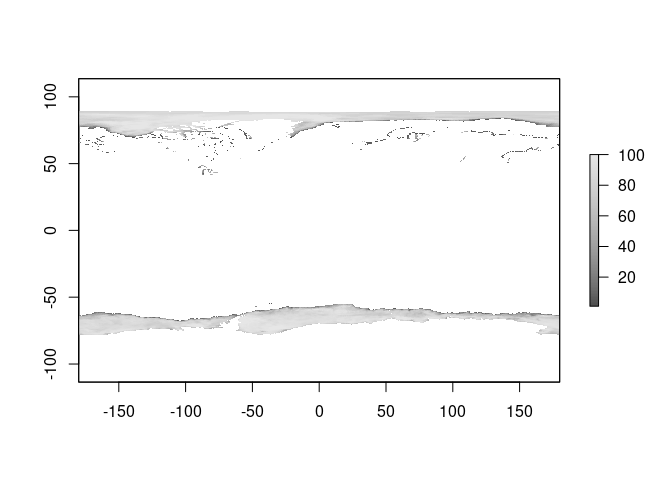
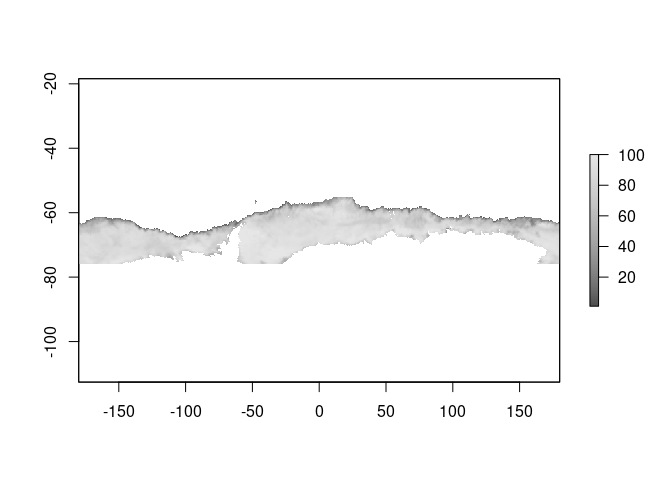
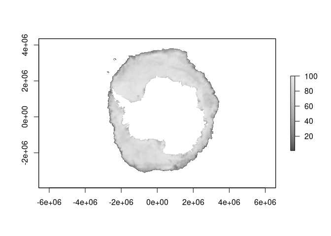
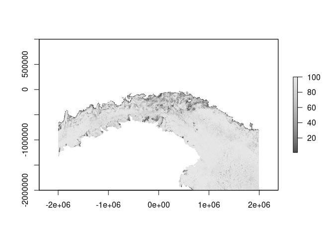

<!-- README.md is generated from README.Rmd. Please edit that file -->

# seaice

<!-- badges: start -->

[](https://github.com/AustralianAntarcticDivision/seaice/actions)
<!-- badges: end -->

The goal of seaice is to read sea ice concentration data directly from
the internet. This package contains functions to find the right file URL
for a given date, for either northern or southern hemisphere data.

NOTE: you don’t need to use the functions in this package, see the
example below which obtains a wrapper function `read_seaice()`. This
package must exist to provide the tools for that to work, but for
various reasons I don’t want the read function to be in this package.

If you want more direct access to the entire sea ice data set [read this
blog post](https://ropensci.org/blog/2018/11/13/antarctic/).

## Work in progress

If you aren’t comfortable installing the development version of
[vapour](https://github.com/hypertidy/vapour.git) (instructions are
given by the example function), then please don’t actually try to run
the example. You can explore the sources and temporary files created by
the functions in this package, they are

-   `nsidc_north_files()`
-   `nsidc_north_ftp()`
-   `nsidc_north_vrt()`
-   `nsidc_north_vrt_text()`
-   `nsidc_south_files()`
-   `nsidc_south_ftp()`
-   `nsidc_south_vrt()`
-   `nsidc_south_vrt_text()`

The `*files()` functions return a data frame of dates and URLs. The
`*_ftp()` functions return the actual URL for a given date (a binary
file). The `*_vrt()` functions return the path to a temporary VRT file
that wraps the source URL for a given date with a [GDAL
VRT](https://gdal.org/drivers/raster/vrt.html) virtual raster. The
`*_vrt_text()` functions return the contents of the VRT file for a given
date.

The `read_seaice()` function defined below relies on dev-vapour package
and wraps up the above to drive GDAL to return the data for a given data
on your raster grid of choice.

This package contains a file list (where the file is on the internet,
and the date it applies to) for a data file, and will construct a raster
format that can be used to read the data directly. This happens via
GDAL, using its virtual raster format VRT. A temporary file is created
to store the information about the file at the URL, and then GDAL does
the rest, downloading the file and reading from it into whatever
grid/projection we specify.

With this we can

-   read any date since 1978-10-26 (currently we are a bit limited to
    the latest but see todo)
-   specify a raster grid, of any resolution, any projection, and any
    extent any where on the planet (the polar regions are really the
    only relevant ones, but we can use the entire earth or part of it)
-   read both hemispheres in one call

If you prefer stars or terra or raster or some other package, throw the
VRT file path at their raster read functions. 👍

## TODO

-   currently only NSIDC, add more providers
-   keep files up to date, started with 2021-05-23
-   be smarter about filling in missing days
-   write helpers for commonly used grids (e.g. 0.25 degree longlat,
    Mercator, or local equal area, etc)
-   write helpers for terra, stars, base image(), netcdf output,
    whatever
-   speed it up, currently a bit slow (25s for each file, but subsequent
    read of each day is fast because the file seems to be cached by GDAL
    or the OS)
-   put the scaling and missing value setting in the VRT (currently use
    of these by raster/stars/terra will get the original byte values)

These files are binary and read over FTP, so the entire file is
downloaded somewhere by GDAL (they are small). Other sources use GeoTIFF
or NetCDF and we are exploring including those as well.

Let us know what you think! See the [Issues
tab](https://github.com/AustralianAntarcticDivision/seaice/issues) to
discuss, or post information about any problems you encounter.

## Installation

You can install the development version from
[GitHub](https://github.com/) with:

``` r
# install.packages("remotes")
remotes::install_github("AustralianAntarcticDivision/seaice")
```

## Example

This is a basic example which shows you how to read sea ice data for any
date since 1978-10-26. The data is projected onto a raster grid, with a
global default provided. You can use the `xylim` argument to specify a
specific raster in any projection.

Go with the default.

``` r
library(seaice)
source(system.file("examples/read_seaice.R", package = "seaice", mustWork = TRUE))
library(raster)  # we could use terra or stars or whatever, see todo 
#> Loading required package: sp

icecol <- grey.colors(100)
zl <- c(1, 100)
ice0 <- read_seaice("2020-10-15")
plot(ice0, col = icecol, zlim = zl)
```



Usually we will want something more specific, like only the southern
hemisphere. To do that, define the right raster grid and set the `xylim`
argument with it.

The source data for this function is 25km pixels, in a polar grid. We
choose 0.2 in degrees as the resolution (about a fifth of 100km which is
about the distance in a degree along a great circle).

``` r
r <- raster(extent(-180, 180, -76, -55), res = 0.2, crs = "+proj=longlat")
(ice <- read_seaice("2020-10-15", xylim = r))
#> class      : RasterLayer 
#> dimensions : 105, 1800, 189000  (nrow, ncol, ncell)
#> resolution : 0.2, 0.2  (x, y)
#> extent     : -180, 180, -76, -55  (xmin, xmax, ymin, ymax)
#> crs        : +proj=longlat +datum=WGS84 +no_defs 
#> source     : memory
#> names      : layer 
#> values     : 1.2, 100  (min, max)

plot(ice, col = icecol, zlim = zl)
```



Or we can pick our own projection/grid that we want.

``` r
rg <- raster(extent(-2e6, 2e6, -1e6, 1e6), res = 25000, crs = "+proj=laea +lat_0=-60 +lon_0=180")
pice <- read_seaice("2020-10-15", xylim = rg)
plot(pice, col = icecol, zlim = zl, asp = 1)

## hack a graticule
ll <- rgdal::project(coordinates(rg), projection(rg), inv = TRUE)
ll[ll[,1] < 0, 1] <- ll[ll[,1] < 0, 1] + 360
contour(setValues(rg, ll[,1]), add = TRUE)
contour(setValues(rg, ll[,2]), add = TRUE)
```


To get exactly the grid used by this source data, use a bit of a trick.

``` r
tfile <- nsidc_south_vrt() ## date does not matter, we just want the native grid specification so get the VRT
## this is the grid, used by NSIDC, here in the abstract (no data in it)
g <- raster(raster(tfile))

native <- read_seaice("2020-10-15", xylim = g)
plot(native, col = icecol, zlim = zl)
```



This grid is an old one, defined as ‘EPSG:3412’. The north is
‘EPSG:3411’ and that can be obtained the same, just replace ‘south’ with
‘north’ in the code above.

``` r
print(native)
#> class      : RasterLayer 
#> dimensions : 332, 316, 104912  (nrow, ncol, ncell)
#> resolution : 25000, 25000  (x, y)
#> extent     : -3950000, 3950000, -3950000, 4350000  (xmin, xmax, ymin, ymax)
#> crs        : +proj=stere +lat_0=-90 +lat_ts=-70 +lon_0=0 +x_0=0 +y_0=0 +datum=WGS84 +units=m +no_defs 
#> source     : memory
#> names      : layer 
#> values     : 1.2, 100  (min, max)
```

## AMSR2 3.125 southern hemisphere files

These files are GeoTIFF, so we need only use a VSI path to the URL
itself.

See the example source.

``` r
fine <- raster(extent(-2e6, 2e6, -2e6, 1e6), res = 3000, crs = "+proj=laea +lat_0=-61 +lon_0=147")
amsr2_ice <- read_amsr2("2020-10-15", xylim = fine)

plot(amsr2_ice, col = icecol, zlim = zl, asp = 1)
```



# Get involved

Let us know what you think! See the [Issues
tab](https://github.com/AustralianAntarcticDivision/seaice/issues) to
discuss, or post information about any problems you encounter.

## Code of Conduct

Please note that the seaice project is released with a [Contributor Code
of
Conduct](https://contributor-covenant.org/version/2/0/CODE_OF_CONDUCT.html).
By contributing to this project, you agree to abide by its terms.
